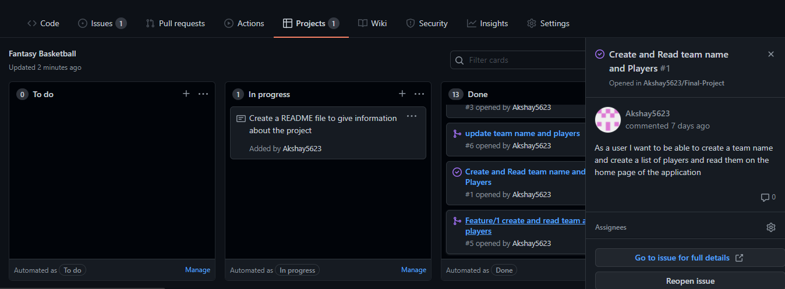

# Final Project
## Contents

* [Project Overview](#project-overview)
* [Application](#application)
* [Pipeline](#pipeline)
* [Unit Testing](#unit-testing)
* [Project Management](#project-management)
* [Risk Assessment](#risk-assessment)
* [Future Improvements](#future-improvements)
* [Author](#author)

## Project Overview
The aim of this project was to achieve the following requirements:
> To create a web application which integrates with a database and demonstrates CRUD functionality
> 
> The application must keep track of two entities that have some kind of relationship with each other.
> 
> The application must interface with a separate database service.
> 
> To utilise containers to host and deploy the application
> 
> To create a CI/CD pipeline which would automatically test, build and deploy the application.
> 
> Unit tests must be written for the application with the aim of achieving high coverage.

## Application

The application I have created is a monolithic flask application which is a fantasy basketball draft. I chose a draft application for simplicity due to the tight deadline for this project. This app allows a user to create a team name based on a city and a following name. Once that has been created there is an ability to read that name on the homepage and underneath that you can update the name, create the players for that team and delete the team

Once the user clicks on the create players link, the user can enter the player they wish to have in each position and submit that to their team. Once submitted the user is redirected to the home screen where their team name and players are both readable. The user then has the option to update the players or delete the players from their team as well as the options mentioned above.

This means that the application is fully CRUD functional on both entities. The two entities have a one-to-many relationship with each other as shown in the Entity Relationship Diagram shown below

 

The database used was an official MySQL image pulled from Docker Hub and created via a docker-compose yaml file.

The objective of the application was to have it running in a Docker swarm with the application service and the database services in containers as shown in the image below. As of now, the application runs smoothly in two separate containers which interact with each other via SQLAlchemy when runnning as a Docker Compose command, but there are issues running the application via a swarm.

## Pipeline

I have created a CI/CD Pipeline for this application via Jenkins which allows for automation of the integration process.

When I produce code on my local machine and push that code to GitHub, the code will be automatically pulled to Jenkins via a webhook and Jenkins will automatically run the pipeline as set out in the Jenkinsfile.

My pipeline consists of 5 stages: Setup, Build, Test, Push and Deploy. Below is a diagram to show an expample of how a CI/CD pipeline works 

The setup stage installs all dependencies needed for all remaining stages of the pipeline 

The build stage builds the application via the docker-compose yaml file

The testing stage uses pytest to unit test the application and then puts the test results and code coverage into a folder on Jenkins.

The push stage pushes the image to Docker Hub

The deploy stage is intended to deploy the application via a Docker swarm.

By having these stages set in place, the job will not pass if a previous stage of the pipeline fails, meaning it is easier to see where any code maybe failing. If the application is stable it will be pushed to another VM for deployment at the deployment stage. 

As seen in the image below, the latest pipeline runs show that the pipeline for this project is running smoothly after commits of code to the project repo and the application is deployed.

## Unit Testing

I have used pytest to run the unit tests on the application, these tests are designed in a way to see if the areas being tested will produce a known value. 

By running the tests as a script within the Jenkins pipeline, I was able to use Junit reports and Cobertura reports to produce test reports and coverage reports respectively

I was able to complete all 13 tests written with a 100% pass rate as well as a 99% code coverage rate as shown in the screenshots below.

## Project Management

To keep a track of the project I used GitHub project boards, this allowed me to keep track of my user stories as comments within the opened issues as seen below

Using GitHub project boards also allowed me to use and keep track of my feature branches easily by tagging related issues to feature branches, leaving less chance for merge conflicts

I used MoSCoW prioritisation for the project, feature branches were used for the Must have priorities placed on the project, however due to the time constraints placed on the project most tasks were considered Must have and there was much less emphasis on tasks that would have been in the Should have or Could have categories. 

## Risk Assessment

The risk assessment table below lists the risks to the project, the description of the risk, mitigation, likelihood and impact.

## Future Improvements

Some of the future improvements I would like to make to the application include: 

* To fix the issues regarding running the application via a Docker swarm which would allow for easier rolling updates.

* To improve the aesthetics of the application as it is currently a very basic looking application.

* To add a fantasy basketball section to the application which would change the relationship between the two entities to a many-to-many relationship to reflect a fantasy sports app rather than just a draft

* To add more features to the application e.g. the ability for users to create accounts.

## Author

Akshay Patel
